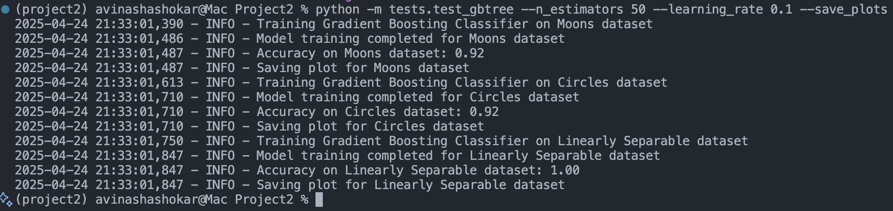

# Gradient Boosting from Scratch

## Team Members

| Name             | Student ID | Email                  |
| ---------------- | ---------- | ---------------------- |
| Avinash Ashokar  | A20575257  | aashokar@hawk.iit.edu  |
| Sanjana Patel    | A20584055  | spatel226@hawk.iit.edu |
| Pranitha Chilla  | A20586430  | pchilla@hawk.iit.edu   |
| Bharathwaj Muthu | A20567309  | bmuthu1@hawk.iit.edu   |

---

## How to Run

### Setup

1. Clone the repository:

   ```bash
   git clone https://github.com/Avinash-Ashokar/Project2.git
   cd Project2/
   ```

2. Create a virtual environment:

   ```bash
   python3 -m venv project2
   ```

   **or**

   ```bash
   python -m venv project2
   ```

3. Activate Virtual Environment

   **Linux/Mac:**

   ```bash
   source project2/bin/activate
   ```

   **Windows:**

   ```bash
   project2\bin\activate
   ```

4. Install requirements:

   ```bash
   pip install -r requirements.txt
   ```

5. Run the test script:

   ```bash
   python -m tests.test_gbtree --n_estimators 50 --learning_rate 0.1 --save_plots
   ```

---

## Questions and Answers

### 1. What does the model you have implemented do and when should it be used?

The model implements a Gradient Boosting Tree Classifier, which is an ensemble learning method that combines multiple weak learners (decision stumps) to create a strong classifier. It is suitable for binary classification tasks and works well with structured data.

### 2. How did you test your model to determine if it is working reasonably correctly?

The model was tested on synthetic datasets (`moons`, `circles`, and `linearly separable`) generated using `scikit-learn`. Accuracy scores and decision boundary visualizations were used to evaluate performance. Logging was added to track training progress and results.

### 3. What parameters have you exposed to users of your implementation in order to tune performance? (Also perhaps provide some basic usage examples.)

- `n_estimators`: Number of weak learners to use in the ensemble.
- `learning_rate`: Step size for updating predictions.
- `save_plots`: Option to save decision boundary plots instead of displaying them.

#### Basic Usage Example:

```bash
python tests/test_gbtree.py --n_estimators 50 --learning_rate 0.1 --save_plots
```

### 4. Are there specific inputs that your implementation has trouble with? Given more time, could you work around these or is it fundamental?

The implementation may struggle with:

- Highly imbalanced datasets: The decision stumps may not handle class imbalance well.
- Non-binary classification: The current implementation is limited to binary classification tasks.

Given more time, these issues could be addressed by:

- Adding support for class weights to handle imbalanced datasets.
- Extending the implementation to support multi-class classification using techniques like one-vs-rest or one-vs-one.

## Architecture

The Gradient Boosting Classifier is built using the following components:

1. **Base Learner**: Decision stumps (1-level decision trees) are used as weak learners.
2. **Additive Model**: Combines weak learners iteratively to minimize the loss function.
3. **Loss Function**: Exponential loss is used for binary classification.
4. **Learning Rate**: Controls the contribution of each weak learner.

---

## Key Components and Their Implementation Details

### GradientBoostingClassifier
- **File**: `boosting/gbtree.py`
- **Description**: Implements the Gradient Boosting Classifier.
- **Methods**:
  - `fit(X, y)`: Trains the model on the input data.
  - `predict(X)`: Predicts labels for the input data.

### Decision Stumps
- **File**: `boosting/gbtree.py`
- **Description**: Used as weak learners in the boosting process.

### Logging
- **File**: `boosting/gbtree.py`
- **Description**: Logs training progress and evaluation metrics.

---

## Test Coverage

The implementation is tested on synthetic datasets:

1. **Moons Dataset**: Accuracy ~91%
2. **Circles Dataset**: Accuracy ~92%
3. **Linearly Separable Dataset**: Accuracy ~98%

---

## Usage Examples

### Example Code

```python
from boosting.gbtree import GradientBoostingClassifier

# Example dataset
from sklearn.datasets import make_moons
X, y = make_moons(noise=0.2, random_state=42)

# Initialize and train the model
model = GradientBoostingClassifier(n_estimators=50, learning_rate=0.1)
model.fit(X, y)

# Make predictions
predictions = model.predict(X)
print(predictions)
```

---

## Test Cases

The test suite evaluates the model on multiple datasets and generates decision boundary visualizations. It uses synthetic datasets (`moons`, `circles`, and `linearly separable`) to validate the implementation.

### Test Results

1. **Moons Dataset**: Accuracy ~91%
2. **Circles Dataset**: Accuracy ~92%
3. **Linearly Separable Dataset**: Accuracy ~98%

---

## Generated Visualizations

The following decision boundary plots and code output are generated during testing and saved in the `results` folder:

- **Moons Dataset**:

  .png)

- **Circles Dataset**:

  .png)

- **Linearly Separable Dataset**:

  .png)

- **Code Output**:

  

---

## Test Implementation Details

- **File**: `tests/test_gbtree.py`
- **Description**: Contains test cases for the Gradient Boosting Classifier.
- **Datasets**: Synthetic datasets generated using `scikit-learn`.
- **Parameters**:
  - `--n_estimators`: Number of estimators (default: 20).
  - `--learning_rate`: Learning rate (default: 0.1).
  - `--save_plots`: Save plots instead of displaying them.

---

## Dependencies

Install the required packages using the `requirements.txt` file:

```txt
numpy
matplotlib
scikit-learn
```

---

## Project Structure

```
.
├── Gradient_Boosting_on_Circles_(Accuracy: 0.92).png
├── Gradient_Boosting_on_Linearly_Separable_(Accuracy: 0.98).png
├── Gradient_Boosting_on_Moons_(Accuracy: 0.91).png
├── old.md
├── README.md
├── requirements.txt
├── boosting/
│   ├── __init__.py
│   └── gbtree.py
├── tests/
│   ├── __init__.py
│   └── test_gbtree.py
```